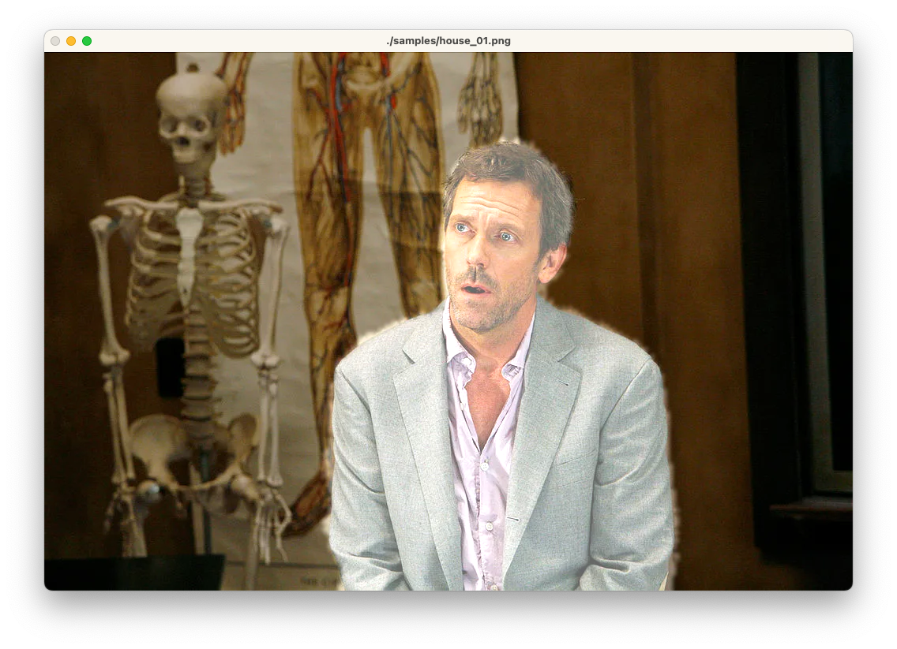

# Machine Learning in Computer Vision

## Image Segmentation: separate humans from background

A lightweight model to segment the prominent humans in the scene 
in videos captured by a smartphone or web camera.
Runs in real-time (~120 FPS) on a laptop CPU via XNNPack TFLite backend.

Returns a two class segmentation label (human or background) per pixel.

| Original image                                            | Final classification                                                    |
|-----------------------------------------------------------|-------------------------------------------------------------------------|
|  |  |

### Build

#### Option 1: pip

Use pip to install the library

```bash
pip install git+https://github.com/st235/HSE.MLInCV.git
```

To run program just call

```bash
human-segmentation
```

The command will show default sample image or

```bash
human-segmentation image1.png
```

to specify custom image.

#### Option 2: Manual build

First of all, you need to activate virtual environment
in you project using the command below. This step is optional,
however, can be very useful to segregate this project from your
global environment.

Moreover, please, do pay attention, that the project uses [opencv contrib](https://pypi.org/project/opencv-contrib-python/).
So, if you're using global environment (instead of virtual) and have
opencv installed, please, do check if your version of opencv is the
right one.

```bash
python3 -m venv .venv
```

The next step is to install all necessary dependencies. Luckily,
all of them are located in [`requirements.txt`](./requirements.txt).
You need to run the command below to install all of them.

```bash
pip install -r requirements.txt
```

Now you're good to go! Hooray 🎉

To run the script you need to find a [demo file](src/image_processor.py).
All source code is located under [src directory](./src).

You can use the command below to run the script:

```bash
python3 src/process.py ./samples/house_01.png
```

As the result you will see something similar to the image below.



### Misc

Code in this repo follows [Google's Python codestyle](https://google.github.io/styleguide/pyguide.html).

