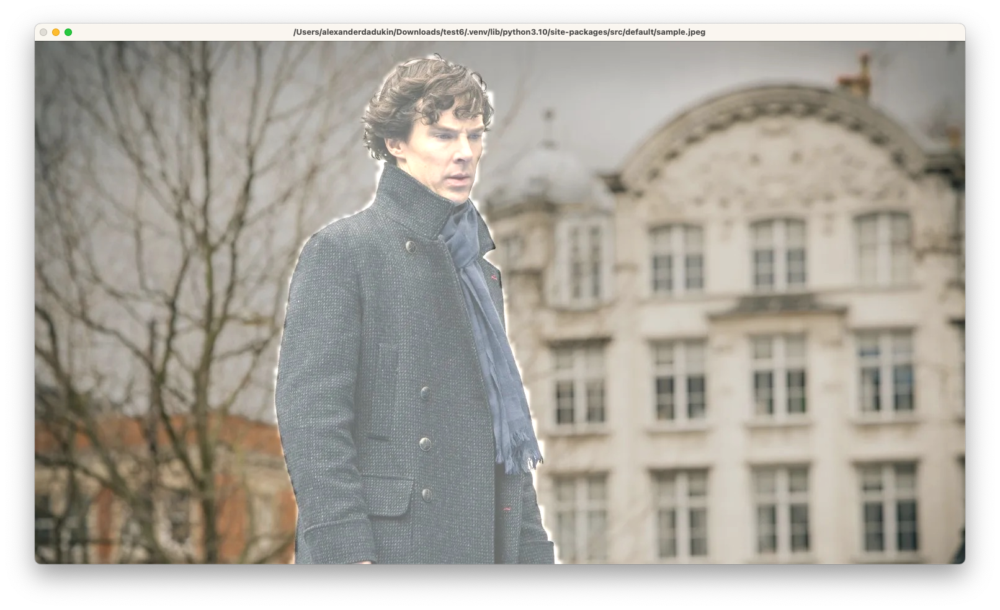
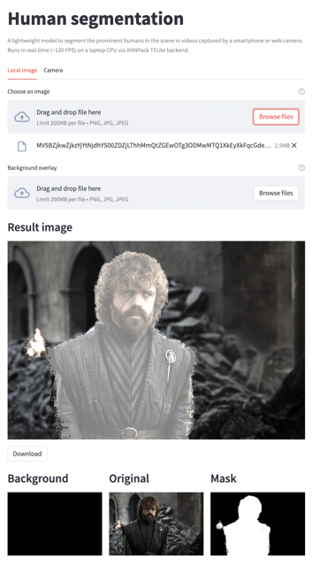
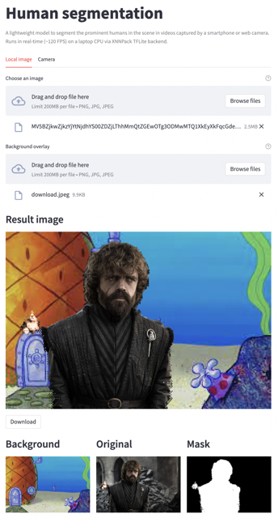
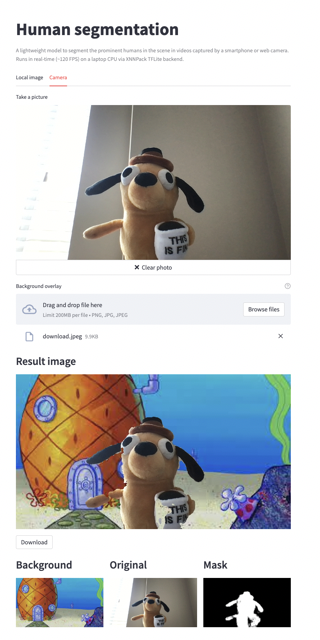

# Machine Learning in Computer Vision

## Image Segmentation: separate humans from background

A lightweight model to segment the prominent humans in the scene
in videos captured by a smartphone or web camera.
Runs in real-time (~120 FPS) on a laptop CPU via XNNPack TFLite backend.

Returns a two class segmentation label (human or background) per pixel.

| Original image                                            | Final classification                                                    |
|-----------------------------------------------------------|-------------------------------------------------------------------------|
|  |  |

## Pre-configured scripts

This project contains automated [Makefile script](./Makefile). The idea behind makefile is to provide
convenient entry point to the project leaving setup headache behind.

_🚨🚨🚨Please, do keep in mind, these scripts are an **experimental** feature.
The scripts **have been tested on MacOS only**. Script should run on Windows or Linux however I cannot guarantee that.
If you experience any issues running them consider to fall back to manual installing process **described later in this document**._

### Targets

Makefile provides a few callable targets. You can see them in the table below:

| Target   | Description                                                                                                                  |
|----------|------------------------------------------------------------------------------------------------------------------------------|
| install  | activates virtual environment, installs all dependencies, including dependencies for development, activates pre-commit hooks |
| build    | provides pre-build binaries, includes wheels                                                                                 |
| test     | calls tests using pytest                                                                                                     |
| format   | calls black to format codestyle                                                                                              |
| lint     | calls pylint to check the codebase                                                                                           |
| clean    | removes virtual environment, cleans Python cache                                                                             |
| web-demo | runs the web-page with a library in demo mode                                                                                |
| demo     | runs the library in demo mode                                                                                                |

### Example

To make sure that everything works as intended you should call **install** target first. You can do it using the command below

```bash
make install
```

When installation is complete you will see `.venv` folder. After installation is complete, you may call any target you want.
For example, to run demo you can use the next command:

```bash
make demo
```

## No-building: getting the code using pip

The easiest way to install the library is to use `pip`. `Pip` can install libraries from Git repositories which
is pretty handful for us. Use the command below to download the code:

```bash
pip install git+https://github.com/st235/HSE.MLInCV.git
```

Pip should install all necessary dependencies and create an alias for the app.
The alias is `human-segmentation`.

To run the program just call the code below:

```bash
human-segmentation
```

The command will show default sample image similar to the next image.



To test the app against different image you can specify them as
the first argument. See the example below:

```bash
human-segmentation image1.png
```

## Manual installation

__You need at least Python 3.9 to run the code.__

### Virtual env and dependencies

#### Venv

First of all, you need to activate virtual environment
in your folder using the command below. This step is optional,
however, can be very useful to segregate the project from your
global environment.

```bash
python3 -m venv .venv
```

Moreover, please, do pay attention, that the project uses [opencv contrib](https://pypi.org/project/opencv-contrib-python/).
So, if you're using global environment (instead of virtual) and have
opencv installed, please, do check if your version of opencv is the
right one.

#### Dependencies

Moreover, you need to install all necessary dependencies. Luckily,
all of them are located in [`requirements.txt`](./requirements.txt).
You need to run the following command to install all of them.

```bash
pip install -r requirements.txt
```

Now you're good to go! Hooray 🎉

### Option 1: build from source using `build`

One can build the app from source.

Please, note that you need [build](https://pypi.org/project/build/) installed. To do so you need to run

```bash
pip install build
```

First step would be to build wheels from the source code. To do so you need to run __build__.

```bash
python3 -m build .
```

When the build is finished you are able to install the library from the produced wheel file.
A command can look like something below:

```bash
pip install dist/human_segmentation-0.0.1-py3-none-any.whl
```

It will start the same installation process as `pip` usually do. After the app is installed successfully
you may call it using `human-segmentation` command. For example,

```bash
human-segmentation
```

## Option 2: run demo as a script

And the last but not least is to run the app manually using [`demo.py`](./demo.py) script.

You can use the next command to run the script to see the sample image:

```bash
python3 demo.py
```

and a slightly different command to test the app against different images:

```bash
python3 demo.py ./samples/house_01.png
```

As the result you will see something similar to the image below.


### Development and contribution

To start local development in the repo, please, ensure that you have all code quality control tools installed.

To do so you need to run a few more commands __(additionally to the [manual installation commands](#manual-installation))__
in the same order as below:

1. Install all dependencies: both production and dev.
Dev dependencies add `linter`, `style formatter`, `pre-commit tools`, and `test runner`.

```
pip install -r requirements.txt
pip install -r dev-requirements.txt
```

2. Install pre-commit hooks. This step is not necessary, however, the same checks will be performed on the server side
when one creates Pull Request.

```
pre-commit install
```

#### Style formatter: black

- Code formatting tool
- Black configuration is located at [pyproject.toml](./pyproject.toml)
- To run black locally one may need to call `black .`

#### Linter: pylint

- Linter
- Pylint configuration is located at [pyproject.toml](./pyproject.toml)
- To run pylint locally one may need to call `pylint src`

#### Pre-commit

- Pre-commit hooks
- Configuration is located at [the special config](./.pre-commit-config.yaml)
- Command runs automatically on every commit, however, to manually test hooks one may want to call `pre-commit run --all-files`

#### Tests

You can run tests by executing the following command

```
pytest .
```

Also, the repository contains regression tests. Long story short: regression tests are assuming that the old
state of the system is correct, therefore at some point you need to generate them. To do so, just call `pytest` with
additional command `--overwrite-regression-result`.

See example below:

```
pytest . --overwrite-regression-result
```

## Web-Page demo

The project also supports web-page demo.

### Build via docker

To build an image you may want to run the command similar to the command below:

```bash
docker build -t web_demo .
```

Docker will use [default Dockerfile](./Dockerfile) to build an image. To run the container you need to specify image and
port.

```bash
docker run -p 8000:8000 web_demo
```

Please, do pay attention that you need **to map ports** using `-p` command.

The app will print something similar to

```
Collecting usage statistics. To deactivate, set browser.gatherUsageStats to False.


  You can now view your Streamlit app in your browser.

  URL: http://0.0.0.0:8000
```

Open the app using `localhost:8000`.

### Local build

You can start web page using the command below:

```bash
make web-demo
```

or you can manually install everything to start web-app

```bash
python -m pip install streamlit
streamlit run web_demo.py
```

### Description

Web app allows you to pick up an image from you local files or web cam
and apply background segregation on it.
Moreover, the app support background overlay like in other modern video engines.

| Local image                                             | Local image + background overlay                                          | Camera image + background overlay                                         |
|---------------------------------------------------------|---------------------------------------------------------------------------|---------------------------------------------------------------------------|
|  |  |   |

## Misc

Code in this repo follows [Google's Python codestyle](https://google.github.io/styleguide/pyguide.html).
